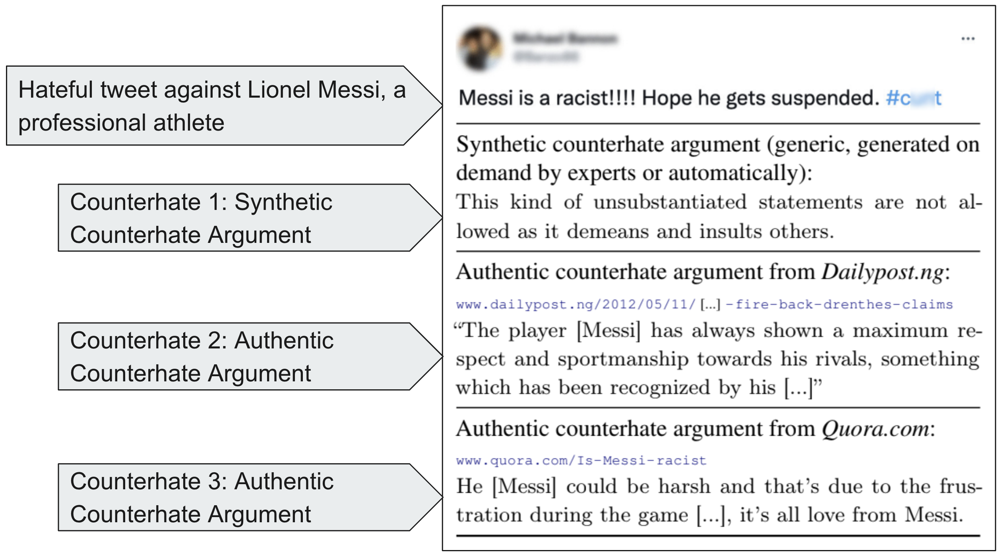

# Finding Authentic Counterhate Arguments

This repository contains the corpus and code of the ACL-23 paper "Finding Authentic Counterhate Arguments: A Case Study with Public Figures". Authors: Abdullah Albanyan, Ahmed Hassan, and Eduardo Blanco.
<br />
<!--[[paper link](https://ojs.aaai.org/index.php/AAAI/article/view/21284)]
[[supplementary materials](/Docs/hate-twitter-supplemental.pdf)]-->

## Introduction
In this work, we propose a methodology that assures the authenticity of the argument and its specificity to the individual of interest. We show that finding arguments in online articles is an efficient alternative to counterhate generation approaches that may hallucinate unsupported arguments.

## Example

We target authentic counterhate arguments that address the specific hateful claims, as exemplified in the bottom two arguments in following Figure 1. 

<p align="center">

</p>

Hateful tweet (top) and three replies with counterhate arguments. Previous work targets synthetic counterhate arguments that tend to be generic (first counterhate argument). In this paper, we find authentic counterhate arguments that address the hateful claims in the tweet at hand (2nd and 3rd counterhate arguments)


<!-- ****************************************************************************************** 
## Citation

```
@article{Albanyan_Blanco_2022,
  title = {Pinpointing Fine-Grained Relationships between Hateful Tweets and Replies},
  volume = {36},
  url = {https://ojs.aaai.org/index.php/AAAI/article/view/21284},
  doi = {10.1609/aaai.v36i10.21284},
  abstractnote = {Recent studies in the hate and counter hate domain have provided the grounds for investigating how to detect this pervasive content in social media. These studies mostly work with synthetic replies to hateful content written by annotators on demand rather than replies written by real users. We argue that working with naturally occurring replies to hateful content is key to study the problem. Building on this motivation, we create a corpus of 5,652 hateful tweets and replies. We analyze their fine-grained relationships by indicating whether the reply (a) is hate or counter hate speech, (b) provides a justification, (c) attacks the author of the tweet, and (d) adds additional hate. We also present linguistic insights into the language people use depending on these fine-grained relationships. Experimental results show improvements (a) taking into account the hateful tweet in addition to the reply and (b) pretraining with related tasks.},
  number = {10},
  journal = {Proceedings of the AAAI Conference on Artificial Intelligence},
  author = {Albanyan, Abdullah and Blanco, Eduardo},
  year = {2022},
  month = jun,
  pages = {10418-10426},
  month_numeric = {6}
}
```
-->
